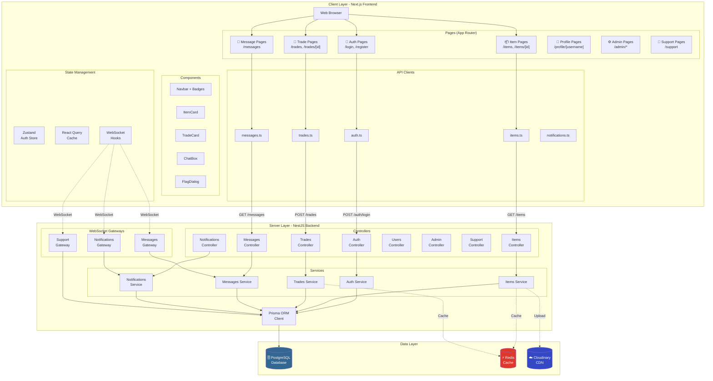
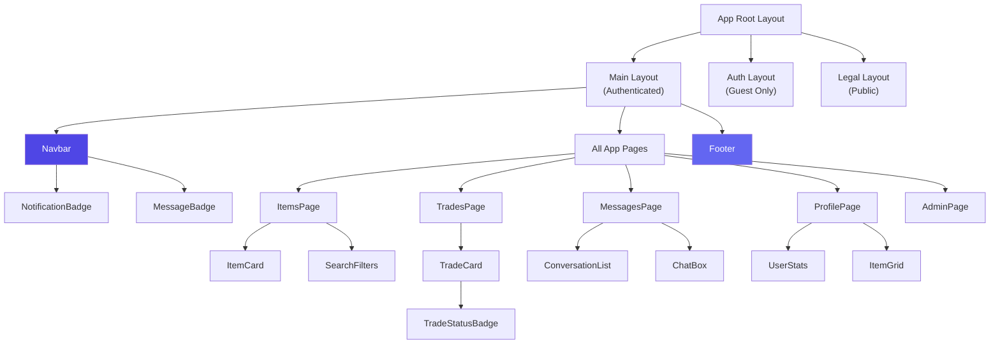
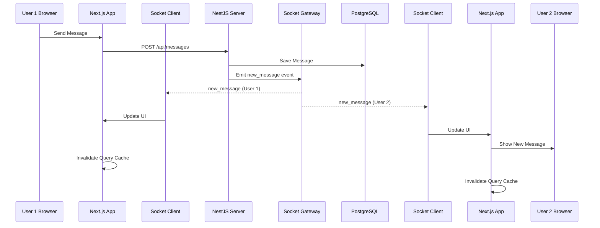
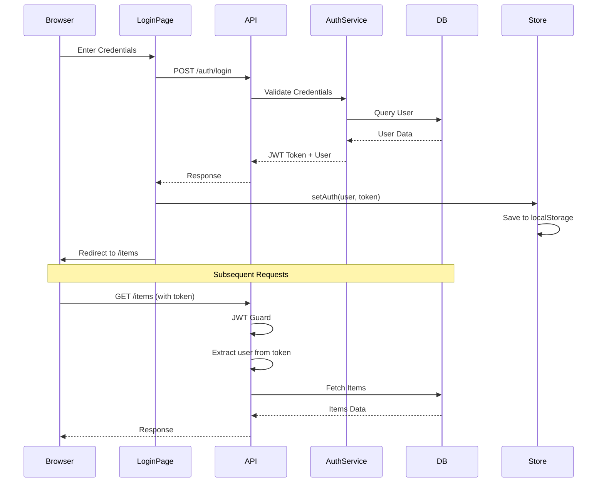
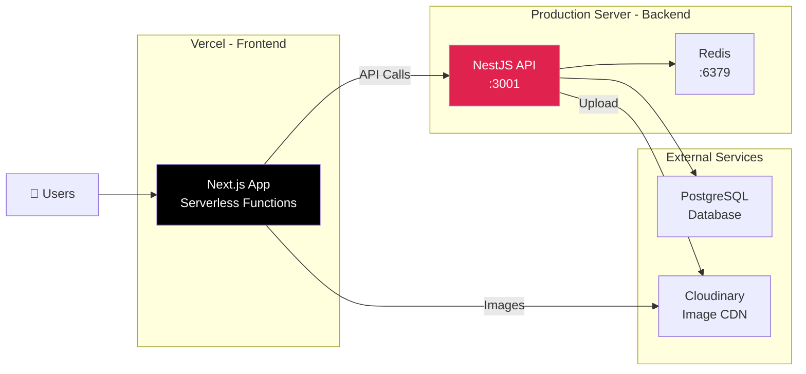

# SwapBuds System Architecture

**Last Updated:** November 26, 2025
**Version:** 0.10.0

## 🎯 Overview

SwapBuds is a peer-to-peer item trading platform built with a modern tech stack:

- **Frontend:** Next.js 14 (App Router), React 18, TypeScript, TailwindCSS, shadcn/ui
- **Backend:** NestJS, TypeScript, Prisma ORM, PostgreSQL
- **Real-time:** Socket.IO for WebSocket connections
- **Infrastructure:** Docker, Redis (caching), Cloudinary (images)

---

## 📊 Full System Architecture

---

## 🗂️ Database Schema Overview

See [database-erd.md](./database-erd.md) for the complete entity-relationship diagram generated from Prisma schema.

### Core Tables

| Table             | Purpose                       | Key Relationships                           |
| ----------------- | ----------------------------- | ------------------------------------------- |
| **users**         | User accounts, authentication | owns items, proposes trades, sends messages |
| **items**         | Tradeable items               | belongs to user, involved in trades         |
| **trades**        | Trade proposals               | connects two users and their items          |
| **conversations** | Direct message threads        | between two users, optional trade context   |
| **messages**      | Chat messages                 | belongs to conversation, sent by user       |
| **notifications** | User notifications            | belongs to user                             |
| **reviews**       | Trade reviews                 | from user to user about a trade             |
| **likes**         | Item likes                    | user likes item                             |
| **comments**      | Item comments                 | user comments on item                       |

### Supporting Tables

| Table                        | Purpose                        |
| ---------------------------- | ------------------------------ |
| **item_images**              | Multiple images per item       |
| **trade_items**              | Multi-item trades (join table) |
| **counter_offers**           | Alternative trade proposals    |
| **flagged_items**            | Content moderation             |
| **disputes**                 | Trade dispute resolution       |
| **support_chats**            | Customer support tickets       |
| **support_messages**         | Support chat messages          |
| **user_verifications**       | ID verification submissions    |
| **audit_logs**               | Admin action tracking          |
| **legal_documents**          | TOS, Privacy Policy versions   |
| **legal_consents**           | User consent tracking          |
| **user_settings**            | User preferences               |
| **notification_preferences** | Notification settings          |
| **mfa_secrets**              | 2FA secrets                    |
| **oauth_accounts**           | Social login accounts          |
| **waitlist**                 | Pre-launch signups             |

---

## 🔌 API Endpoints Reference

See [API_ENDPOINTS.md](./API_ENDPOINTS.md) for complete API documentation.

### Quick Reference

| Module        | Base Path            | Key Endpoints                         |
| ------------- | -------------------- | ------------------------------------- |
| Auth          | `/api/auth`          | login, register, logout, me           |
| Items         | `/api/items`         | CRUD, search, recommendations         |
| Trades        | `/api/trades`        | create, accept, reject, counter-offer |
| Messages      | `/api/messages`      | conversations, send, read             |
| Users         | `/api/users`         | profile, settings, statistics         |
| Notifications | `/api/notifications` | list, read, preferences               |
| Admin         | `/api/admin`         | user management, stats, audit logs    |
| Moderation    | `/api/moderation`    | flags, review, approve/remove         |
| Support       | `/api/support`       | tickets, chat, resolve                |
| Verification  | `/api/verification`  | submit, review, approve/reject        |

---

## 🎨 Frontend Component Hierarchy

See [FRONTEND_PAGES.md](./FRONTEND_PAGES.md) for complete page and component documentation.

---

## ⚡ Real-time Communication Flow

---

## 🔒 Authentication & Authorization Flow

---

## 📡 WebSocket Event System

### Events Emitted by Server

| Event               | Gateway       | Trigger              | Payload                       |
| ------------------- | ------------- | -------------------- | ----------------------------- |
| `new_message`       | Messages      | New message sent     | `{ message, conversationId }` |
| `message_read`      | Messages      | Message marked read  | `{ messageId, readAt }`       |
| `new_notification`  | Notifications | Notification created | `{ notification }`            |
| `notification_read` | Notifications | Notification read    | `{ notificationId }`          |
| `support_message`   | Support       | Support message sent | `{ message, chatId }`         |
| `agent_joined`      | Support       | Agent joins chat     | `{ agentId, chatId }`         |
| `typing`            | Messages      | User typing          | `{ userId, conversationId }`  |

### Events Listened by Server

| Event                | Gateway  | Action                             |
| -------------------- | -------- | ---------------------------------- |
| `join_conversation`  | Messages | Join room for conversation updates |
| `leave_conversation` | Messages | Leave conversation room            |
| `start_typing`       | Messages | Broadcast typing indicator         |
| `stop_typing`        | Messages | Stop typing indicator              |
| `join_support_chat`  | Support  | Join support chat room             |

---

## 🚀 Deployment Architecture

---

## 🔐 Security Measures

### Authentication

- JWT tokens (httpOnly cookies)
- Bcrypt password hashing
- Session management (localStorage/sessionStorage based on "Remember Me")
- Token expiry and refresh

### Authorization

- Role-based access control (USER, MODERATOR, SUPPORT, ADMIN)
- Route guards (frontend and backend)
- Resource ownership validation

### Data Protection

- Input validation (Zod schemas)
- SQL injection prevention (Prisma ORM)
- XSS protection (React auto-escaping)
- CORS configuration
- Rate limiting (throttler)
- reCAPTCHA v3 on auth endpoints

### Content Security

- Content moderation system
- User-reported flags
- ID verification system
- Audit logging for admin actions

---

## 📈 Performance Optimizations

### Frontend

- React Query caching (30-minute stale time)
- WebSocket fallback polling (30s interval)
- Image optimization (next/image)
- Code splitting (React.lazy)
- Memoization (useMemo, useCallback)

### Backend

- Redis caching (frequently accessed data)
- Database indexing (all foreign keys, search fields)
- Pagination (limit/offset)
- Lazy loading (Prisma relations)
- Connection pooling

### Real-time

- Room-based WebSocket channels
- Event debouncing (typing indicators)
- Selective query invalidation

---

## 🔄 State Management Strategy

### Global State (Zustand)

- User authentication
- WebSocket connection status
- Notification counts
- UI preferences

### Server State (React Query)

- Items, trades, messages (cached)
- User profiles (cached)
- Notifications (cached)
- Admin data (no caching)

### Local State (React useState)

- Form inputs
- UI toggles (modals, dropdowns)
- Temporary data (search filters)

---

## 📚 Related Documentation

- [Database ERD](./database-erd.md) - Complete entity-relationship diagram
- [API Endpoints](./API_ENDPOINTS.md) - Full API reference
- [Frontend Pages](./FRONTEND_PAGES.md) - Page and component documentation
- [Backend Architecture](../swapbuds-backend/docs/ARCHITECTURE.md) - Detailed backend docs
- [Frontend Testing](../swapbuds-frontend/TESTING.md) - Testing strategy

---

**For detailed implementation guides, see module-specific documentation in:**

- `swapbuds-backend/docs/` - Backend module docs
- `swapbuds-frontend/docs/` - Frontend feature docs
